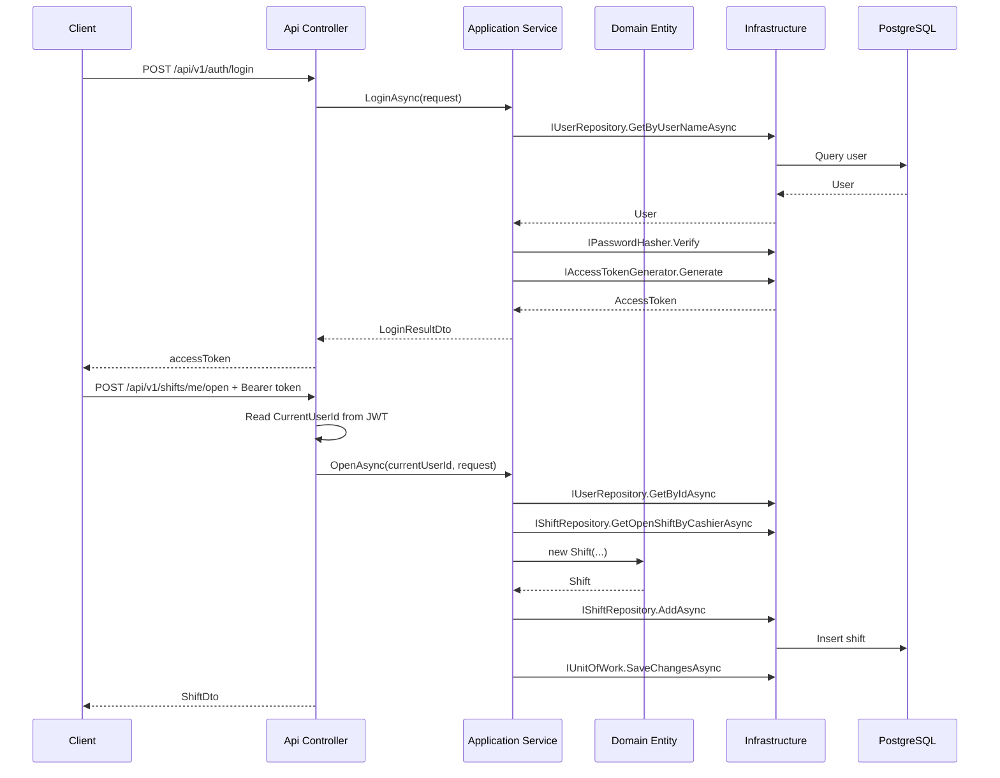

# Luong Shift Dang Nhap Va Mo Ca Theo DDD

Tai lieu nay giai thich use case "shift dang nhap va mo ca lam viec" trong `meu-omni` theo cach nhin DDD thuc dung.

## 1. Muc tieu nghiep vu

Use case nay giai quyet 2 hanh dong lien tiep:

1. Nhan vien thu ngan dang nhap vao he thong.
2. Sau khi dang nhap thanh cong, nhan vien mo ca lam viec cua minh.

Rule nghiep vu hien tai da duoc encode vao code:

- User phai ton tai.
- User phai o trang thai `Active`.
- Chi role `Cashier` hoac `Admin` moi duoc mo ca.
- Moi cashier chi duoc co toi da 1 ca dang mo.
- So tien dau ca khong duoc am.

## 2. Vi tri cua tung phan trong DDD

### Api

Layer API chi nhan HTTP request, lay thong tin tu request va tra HTTP response.

File chinh:

- `src/MeuOmni.Api/Controllers/AuthController.cs`
- `src/MeuOmni.Api/Controllers/ShiftsController.cs`
- `src/MeuOmni.Api/Controllers/BaseApiController.cs`
- `src/MeuOmni.Api/Program.cs`

API khong chua rule nghiep vu chinh. No chi chuyen request vao application service.

### Application

Layer Application dieu phoi use case.

File chinh:

- `src/MeuOmni.Application/Authentication/Services/AuthApplicationService.cs`
- `src/MeuOmni.Application/Shifts/Services/ShiftApplicationService.cs`
- `src/MeuOmni.Application/Authentication/Commands/LoginRequest.cs`
- `src/MeuOmni.Application/Shifts/Commands/OpenShiftRequest.cs`
- `src/MeuOmni.Application/Abstractions/IPasswordHasher.cs`
- `src/MeuOmni.Application/Abstractions/IAccessTokenGenerator.cs`

Day la noi "dieu pho i flow". No khong biet JWT cu the duoc ky nhu the nao, cung khong biet password hash bang thuat toan nao. No chi biet contract.

### Domain

Layer Domain giu entity, aggregate va business rule cot loi.

File chinh:

- `src/MeuOmni.Domain/AccessControl/Entities/User.cs`
- `src/MeuOmni.Domain/Shifts/Entities/Shift.cs`
- `src/MeuOmni.Domain/AccessControl/Repositories/IUserRepository.cs`
- `src/MeuOmni.Domain/Shifts/Repositories/IShiftRepository.cs`
- `src/MeuOmni.Domain/Common/DomainException.cs`

Domain khong biet HTTP, khong biet EF Core, khong biet JWT.

### Infrastructure

Layer Infrastructure implement cac contract ky thuat.

File chinh:

- `src/MeuOmni.Infrastructure/Security/Pbkdf2PasswordHasher.cs`
- `src/MeuOmni.Infrastructure/Security/JwtAccessTokenGenerator.cs`
- `src/MeuOmni.Infrastructure/Security/JwtOptions.cs`
- `src/MeuOmni.Infrastructure/Repositories/UserRepository.cs`
- `src/MeuOmni.Infrastructure/Repositories/ShiftRepository.cs`
- `src/MeuOmni.Infrastructure/Persistence/MeuOmniDbContext.cs`
- `src/MeuOmni.Infrastructure/Persistence/DatabaseSeeder.cs`

Infrastructure lo chuyen "contract" thanh "code chay that".

## 3. Luong 1: Dang nhap

### Buoc 1: API nhan request login

`AuthController` nhan `POST /api/v1/auth/login`.

Code:

- `src/MeuOmni.Api/Controllers/AuthController.cs`

Y nghia:

- Controller nhan body JSON.
- Body duoc bind vao `LoginRequest`.
- Controller khong tu kiem tra password.
- Controller goi `authApplicationService.LoginAsync(...)`.

Day la dung tinh than DDD: controller mong, khong giam rule nghiep vu.

### Buoc 2: Application service xu ly dang nhap

`AuthApplicationService` la noi xu ly use case dang nhap.

Code:

- `src/MeuOmni.Application/Authentication/Services/AuthApplicationService.cs`

No lam 4 viec:

1. Tim user theo username qua `IUserRepository`.
2. Kiem tra user co `Active` khong.
3. Kiem tra password bang `IPasswordHasher`.
4. Neu hop le thi tao access token bang `IAccessTokenGenerator`.

Day la diem quan trong:

- `IUserRepository` la contract de lay user.
- `IPasswordHasher` la contract de verify mat khau.
- `IAccessTokenGenerator` la contract de phat token.

Application service khong phu thuoc truc tiep vao `UserRepository`, `Pbkdf2PasswordHasher`, hay `JwtAccessTokenGenerator`. Nho do no de test va de thay implementation.

### Buoc 3: Domain dong vai tro gi trong login

Trong use case login, domain `User` dong vai tro du lieu nghiep vu da duoc duy tri invariant co ban.

Code:

- `src/MeuOmni.Domain/AccessControl/Entities/User.cs`

Entity `User` giu:

- `UserName`
- `DisplayName`
- `RoleCode`
- `PasswordHash`
- `Status`

Tai sao `PasswordHash` nam trong Domain:

- Vi mat khau da hash la mot phan cua trang thai user.
- Day la du lieu nghiep vu can duoc bao toan cung entity.
- Domain khong can biet hash bang PBKDF2 hay bcrypt, no chi giu ket qua hash.

### Buoc 4: Infrastructure verify password va tao JWT

Implementation that duoc dat o Infrastructure:

- `src/MeuOmni.Infrastructure/Security/Pbkdf2PasswordHasher.cs`
- `src/MeuOmni.Infrastructure/Security/JwtAccessTokenGenerator.cs`

Y nghia thiet ke:

- Application chi noi "hay verify password" va "hay tao token".
- Infrastructure moi quyet dinh verify bang PBKDF2 va ky token bang JWT.

`JwtOptions` doc config JWT tu `appsettings.json`:

- `src/MeuOmni.Infrastructure/Security/JwtOptions.cs`

`Program.cs` dung cung `JwtOptions` de cau hinh `AddJwtBearer(...)`:

- `src/MeuOmni.Api/Program.cs`

Nghia la:

- Khi login, Infrastructure phat token.
- Khi goi API can bao ve, API middleware dung cung cau hinh de validate token.

## 4. Luong 2: Mo ca lam viec

### Buoc 1: API lay user hien tai tu JWT

`ShiftsController` nhan request `POST /api/v1/shifts/me/open`.

Code:

- `src/MeuOmni.Api/Controllers/ShiftsController.cs`
- `src/MeuOmni.Api/Controllers/BaseApiController.cs`

`[Authorize]` bao dam request phai co token hop le.

`BaseApiController.CurrentUserId` lay `ClaimTypes.NameIdentifier` tu JWT roi parse thanh `Guid`.

Y nghia:

- Controller khong cho client tu truyen `CashierId`.
- User nao dang dang nhap thi mo ca cho chinh user do.
- Cach nay an toan hon va dung voi use case POS thuc te.

### Buoc 2: Application service dieu phoi use case mo ca

`ShiftApplicationService.OpenAsync(...)` la noi xu ly trung tam.

Code:

- `src/MeuOmni.Application/Shifts/Services/ShiftApplicationService.cs`

No lam cac buoc:

1. Tim user theo `cashierId` tu token.
2. Kiem tra user ton tai.
3. Kiem tra user dang `Active`.
4. Kiem tra role la `Cashier` hoac `Admin`.
5. Kiem tra cashier chua co ca dang mo.
6. Tao `Shift` moi.
7. Luu qua repository va `UnitOfWork`.

Day la application service dung nghia:

- No ket hop nhieu repository.
- No dieu phoi mot use case hoan chinh.
- No khong chua code SQL.
- No khong nhung vao HTTP details.

### Buoc 3: Domain entity `Shift` giu rule cot loi

Entity `Shift` nam o:

- `src/MeuOmni.Domain/Shifts/Entities/Shift.cs`

Khi tao `new Shift(cashierId, registerCode, openingCash)`, domain tu bao ve mot so invariant:

- `openingCash` khong duoc am.
- `registerCode` bat buoc phai co.
- Shift moi tao se co `Status = Open`.
- `OpenedAtUtc` duoc gan ngay tai thoi diem tao.

Noi dung nay rat quan trong trong DDD:

- Rule lien quan truc tiep den doi tuong `Shift` phai nam trong `Shift`.
- Khong day het validation vao controller hay application service.

Application service kiem tra "cashier da co ca mo chua" vi day la rule can doc repository.
Domain entity kiem tra "so tien dau ca co hop le khong" vi day la invariant cua chinh aggregate.

## 5. Sequence tong the

## 6. Vi sao day la "chuan DDD" hon cach gom tat ca vao mot service lon

Neu viet theo kieu khong tach layer, ta thuong thay:

- Controller tu query DB.
- Controller tu verify password.
- Controller tu tao JWT.
- Controller tu check shift da mo hay chua.
- Rule nam rai rac khap noi.

Trong `meu-omni` hien tai, phan tach da ro hon:

- API chi lo giao tiep HTTP.
- Application chi lo use case.
- Domain giu rule cua entity va aggregate.
- Infrastructure lo cong nghe cu the.

Ket qua:

- De test hon.
- De thay doi cong nghe hon.
- De onboard hon.
- De mo rong them use case `close shift`, `handover shift`, `shift report` hon.

## 7. Vi sao mot so rule dat o Application thay vi Domain

Mot cau hoi hay gap la: tai sao "cashier da co ca dang mo" lai khong nam trong `Shift`?

Ly do:

- `Shift` khong tu minh biet duoc trong database co bao nhieu shift khac.
- Rule nay can doc repository.
- Day la rule lien aggregate va lien persistence.

Vi vay, no hop ly khi dat trong `ShiftApplicationService`.

Nguoc lai, rule "opening cash khong duoc am" nen nam trong `Shift` vi:

- No la invariant cua chinh entity.
- Khong can query repository.

## 8. Cac contract quan trong trong use case nay

### `IPasswordHasher`

Nam o:

- `src/MeuOmni.Application/Abstractions/IPasswordHasher.cs`

Y nghia:

- Application chi can biet co the `Hash` va `Verify`.
- Infrastructure moi quyet dinh PBKDF2.

### `IAccessTokenGenerator`

Nam o:

- `src/MeuOmni.Application/Abstractions/IAccessTokenGenerator.cs`

Y nghia:

- Application chi can biet co the tao access token tu `User`.
- Infrastructure moi quyet dinh JWT claim, issuer, audience, signing key.

### `IUserRepository` va `IShiftRepository`

Nam o Domain vi day la repository contract cua nghiep vu:

- Domain/Application can noi "toi can lay user" hoac "toi can lay ca dang mo".
- Infrastructure moi la noi viet EF Core/PostgreSQL de thuc hien.

## 9. Du lieu demo de test use case

`DatabaseSeeder` seed san:

- `admin.demo / 123456`
- `cashier.demo / 123456`

File:

- `src/MeuOmni.Infrastructure/Persistence/DatabaseSeeder.cs`

Request mau:

- `src/MeuOmni.Api/MeuOmni.Api.http`

Thu tu test:

1. Goi login bang `cashier.demo`.
2. Lay `accessToken` tu response.
3. Gan token vao request `POST /api/v1/shifts/me/open`.
4. Truyen `registerCode` va `openingCash`.

## 10. Ket luan

Use case "dang nhap va mo ca" trong `meu-omni` dang di theo DDD theo huong sau:

- `User` va `Shift` la nghiep vu cot loi.
- `AuthApplicationService` va `ShiftApplicationService` dieu phoi use case.
- `IPasswordHasher`, `IAccessTokenGenerator`, `IUserRepository`, `IShiftRepository` la cac contract.
- `Pbkdf2PasswordHasher`, `JwtAccessTokenGenerator`, repository EF Core/PostgreSQL la implementation o Infrastructure.
- API controller giu mong de khong nuot mat ranh gioi nghiep vu.

Neu muon day use case nay len "DDD day hon" trong cac buoc tiep theo, co the bo sung:

- `CurrentUserContext` abstraction thay vi doc claim truc tiep o controller.
- `RolePermission` va authorization policy thay cho check role bang string.
- domain event khi mo ca thanh cong.
- migration PostgreSQL dau tien thay cho `EnsureCreated`.

